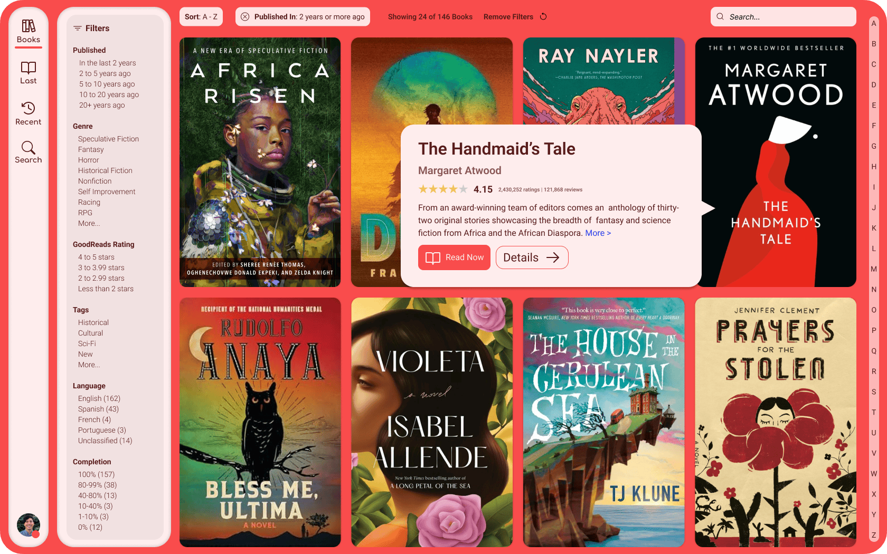

# Bookbag

**A modern redesign of [Calibre-Web](https://github.com/janeczku/calibre-web).**

> ⚠️ Bookbag is in early development and is not stable. It is offered as-is. 
> ⚠️ Please do not host Bookbag on a public server. There are known security issues and the app has not been properly pen tested.

## About

Bookbag is a fork of calibre-web that incorporates a complete redesign of the user interface. The goal is to make a foss alternatives to the popular proprietary ebook management apps that provides a user experience is just as good, if not better, than what they provide. We shouldn't have to choose between having beautiful, fucntional apps and supporting FOSS.

## Features

**Live Filtering** simply select a filter from the sidepanel and matching books are instantly shown.
**Live Book Cover Resize** Instantly resize book covers.
**Instant Search** Search is instantly applied, just start typing in the search field.
**Advanced Search** New Advanced Search design lets you search using any combination of metadata.
**Instant Sort** Sorting of books is instantly applied.
**Complete Redesign of Admin Settings** Single page settings using AJAX form submission to instantly apply any setting changes. Care has been taken to preserve as many settings from Calibre-Web as is practical at this stage. Beware, advanced features require further testing.
**Easy Setup Wizard** No temporary dummy admin account. Setup wizard automatically starts on first launch and lets you create your own account and upload your book library.
**Kobo Sync & Email to eReader** Retains calibre-web functionality for ereaders, although testing is still needed to ensure a smooth experience.

## Quick Start
  
Bookbag is early in development, do not install it as your production server.
- Download and unpack files to your server/container
- Create venv and install dependencies in requirements.txt and optionally optional-requirements.txt
- run python cps.py

**Docker Image Coming Soon**

## Setup
There is now a flow for first time login and setup. Follow the setup wizard after instaling to import your metadata.db. If you are bringing your own metadata.db, book files must still be migrated manually. Place them in the same folder as your metadata.db (/books by default)

Recommended to set up email config in settings for password resets.

## Requirements

- Python 3.8 or newer (3.12+ recommended)
- A Calibre library (`metadata.db`)
- [Calibre CLI Tools](https://calibre-ebook.com) — for ebook conversion
- [Kepubify](https://github.com/pgaskin/kepubify) — for Kobo support
- [ImageMagick](https://imagemagick.org) — for cover extraction from EPUBs

## License

Bookbag is a fork of [Calibre-Web](https://github.com/janeczku/calibre-web) and is licensed under the [GPL v3 License](LICENSE).

- [Calibre-Web](https://github.com/janeczku/calibre-web) — [GPL v3](LICENSE)
- [Inter](https://github.com/rsms/inter) — [SIL Open Font License 1.1](cps/static/fonts/Inter/OFL.txt)
- [Comfortaa](https://github.com/alexeiva/comfortaa) — [SIL Open Font License 1.1](cps/static/fonts/Comfortaa/OFL.txt)
- [Phosphor Icons](https://phosphoricons.com/) — [MIT License](LICENSE-PHOSPHOR-ICONS.txt)

